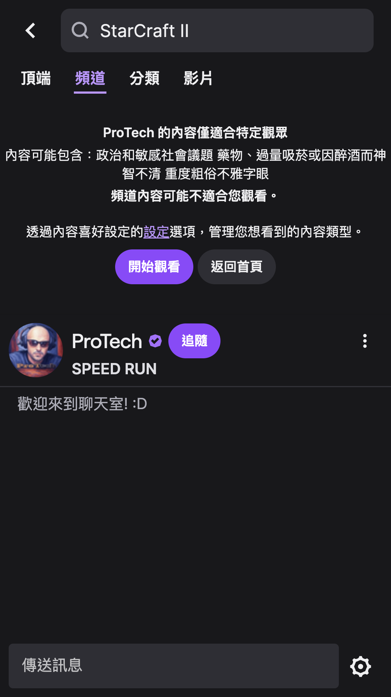

# Twitch Automation Test

Simulate user search and live stream browsing operations on the Twitch website using Python and Selenium.

## Local GIF Animation Demo

Here's a demonstration of the automated test running locally:




## Prerequisites

* **Python:** Ensure Python is installed on your system.
* **Google Chrome Browser:** The tests will run in the Chrome browser.

## Setup Steps

1.  **clone repository:**
    ```bash
    git clone https://github.com/zxc5131210/opennet-homework.git
    ```

2.  **Install dependencies:**
    ```bash
    pip install -r requirements.txt
    ```
## Execute Tests

Run the following command from the project root directory:

```bash
pytest
