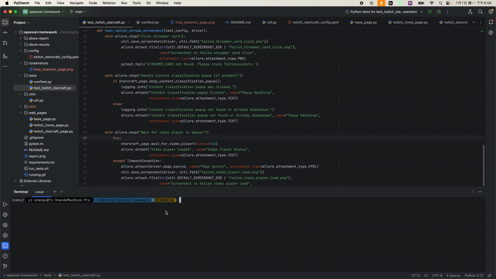
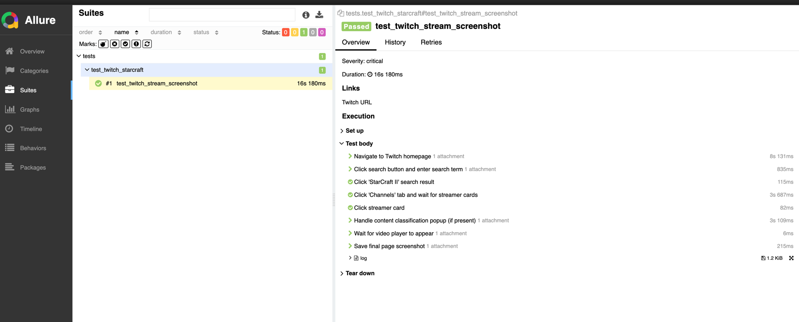

## Twitch Automation Test

Project overview This project aims to simulate the core operation process of users on the Twitch website through automated testing, including searching for specific game live broadcasts, browsing channel lists, and watching live content. Through Python and Selenium WebDriver technology, we can efficiently verify the functionality and stability of the Twitch website.

## Main functions
**Automatic navigation**: Navigate to the homepage of the Twitch website.

**Keyword search**: Enter and search for specified live content (for example: StarCraft II).

**Channel browsing**: Navigate to the search results page and browse related channels.

**Live viewing**: Click to enter the live broadcast room and verify whether the video player is loaded normally.

**Environment simulation**: Supports simulating the mobile browser environment for testing.

**Screenshots and logs**: Automatically take screenshots and record detailed execution logs during the test process to facilitate tracing and troubleshooting.

**Flexible Configuration**: Manage URLs, search keywords, screenshot names, and various page element locators through external YAML configuration files to improve test flexibility and maintainability.

## Local GIF Animation Demo

Here's a demonstration of the automated test running locally:



## Prerequisites

* **Python:** Ensure Python is installed on your system.
* **Google Chrome Browser:** The tests will run in the Chrome browser.

## Setup Steps

1.  **clone repository:**
    ```bash
    git clone https://github.com/zxc5131210/opennet-homework.git
    ```

2.  **Create and activate a virtual environment (recommended):**
    A virtual environment helps isolate project dependencies, preventing conflicts with system-wide or other project dependencies.
    ```bash
    python -m venv venv
    ```
    *Activate on macOS/Linux:*
    ```bash
    source venv/bin/activate
    ```
3.  **Install project dependencies:**
    ```bash
    pip install -r requirements.txt
    
## Execute Tests

Run the following command from the project root directory:

Before running the script, give it execute permission:
```bash
chmod +x run_tests.sh
````
### Run All Tests and Generate Report
```bash
./run_tests.sh
```
