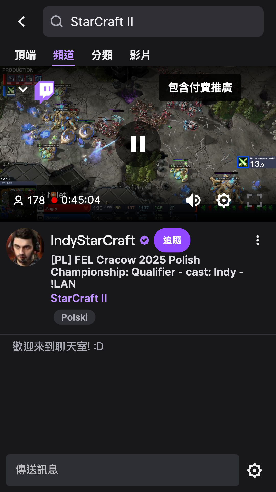

# Twitch 自動化測試

使用 Python 和 Selenium 模擬使用者在 Twitch 網站上進行搜尋和瀏覽實況的操作。

## 測試本地運行的 GIF 動畫

以下是自動化測試在本地運行的示範：




## 前提條件

* **Python:** 確保您的系統上安裝了 Python。
* **Google Chrome 瀏覽器:** 測試將在 Chrome 瀏覽器中運行。

## 設定步驟

1.  **clone repository:**
    ```bash
    git clone https://github.com/zxc5131210/opennet-homework.git
    ```

2.  **安裝依賴:**
    ```bash
    pip install -r requirements.txt
    ```
## 執行測試

在專案根目錄下運行以下命令：

```bash
pytest tests/test_twitch_starcraft.py

